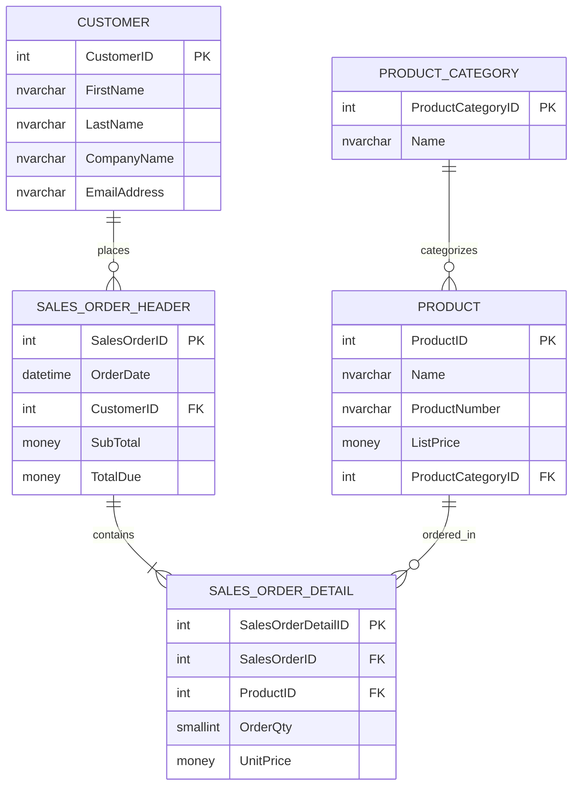

# Plantilla de Diagrama Entidad-Relación (Mermaid)

Para esquemas de Microsoft SQL Server como AdventureWorksLT (SalesLT):

```mermaid
erDiagram
    CUSTOMER {
        int CustomerID PK
        nvarchar FirstName
        nvarchar LastName
        nvarchar CompanyName
        nvarchar EmailAddress
    }
    SALES_ORDER_HEADER {
        int SalesOrderID PK
        datetime OrderDate
        int CustomerID FK
        money SubTotal
        money TotalDue
    }
    SALES_ORDER_DETAIL {
        int SalesOrderDetailID PK
        int SalesOrderID FK
        int ProductID FK
        smallint OrderQty
        money UnitPrice
    }
    PRODUCT {
        int ProductID PK
        nvarchar Name
        nvarchar ProductNumber
        money ListPrice
        int ProductCategoryID FK
    }
    PRODUCT_CATEGORY {
        int ProductCategoryID PK
        nvarchar Name
    }

    CUSTOMER ||--o{ SALES_ORDER_HEADER : "places"
    SALES_ORDER_HEADER ||--|{ SALES_ORDER_DETAIL : "contains"
    PRODUCT ||--o{ SALES_ORDER_DETAIL : "ordered_in"
    PRODUCT_CATEGORY ||--o{ PRODUCT : "categorizes"
```
